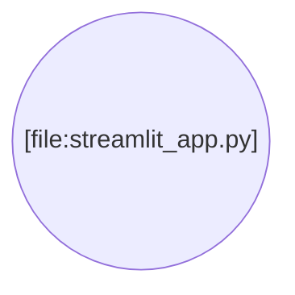

https://github.com/streamlit/streamlit-example# Documentation for streamlit-example

## 1. Overview

This repository hosts a customizable Streamlit application (`streamlit-example`). The project is designed to serve as a functional starting point, requiring users to modify the core logic within the main application file.

The primary entry point for customization is the `/streamlit_app.py` file, which contains the application's structure and execution logic.

While the existing external documentation provides general links to Streamlit resources and community forums, this document provides the necessary technical instructions for project setup and execution, which were previously omitted.

---

## 2. Setup and Execution

To run the Streamlit application locally, you must first install the required dependencies defined in `requirements.txt`.

### Prerequisites

*   Python 3.8+
*   `pip` (Python package installer)

### Installation

1.  Clone the repository:
    ```bash
    git clone [repository-url]
    cd streamlit-example
    ```

2.  Install the required dependencies using the `requirements.txt` file:
    ```bash
    pip install -r requirements.txt
    ```

### Running the Application

Execute the Streamlit application using the standard command pointed at the primary application file:

```bash
streamlit run streamlit_app.py
```

The application will typically open automatically in your default web browser at `http://localhost:8501`.

### Development Environment

Note the inclusion of the `.devcontainer/` directory and associated configuration (`devcontainer.json`), which facilitates development using VS Code Dev Containers or GitHub Codespaces, providing a standardized and ready-to-use development environment.

---

## 3. Repository Map

The following map outlines the structure of the `streamlit-example` repository:

```
streamlit-example/
|-- .devcontainer/
|-- README.md
|-- requirements.txt
|-- streamlit_app.py
    |-- devcontainer.json
```

| File/Directory | Description |
| :--- | :--- |
| `.devcontainer/` | Configuration files for VS Code Dev Containers or GitHub Codespaces. |
| `README.md` | General project overview and external resource links. |
| `requirements.txt` | List of necessary Python dependencies (e.g., `streamlit`). |
| `streamlit_app.py` | The main application file containing the Streamlit UI and business logic. |
| `devcontainer.json` | Specifies the settings for the development container setup. |

---

## 4. Code Context Graph

The following diagram illustrates the relationship between the key components in the repository. As this is a minimalistic application, the structure shows a single entry point file.



---

## 5. API Reference

The code analysis for `streamlit-example` did not identify any reusable functions or classes defined within the scope of the project.

The application is structured as a single-script Streamlit application (`streamlit_app.py`), relying on direct Streamlit calls rather than compartmentalized internal modules or helper functions. Customization is expected to involve editing this main script directly.